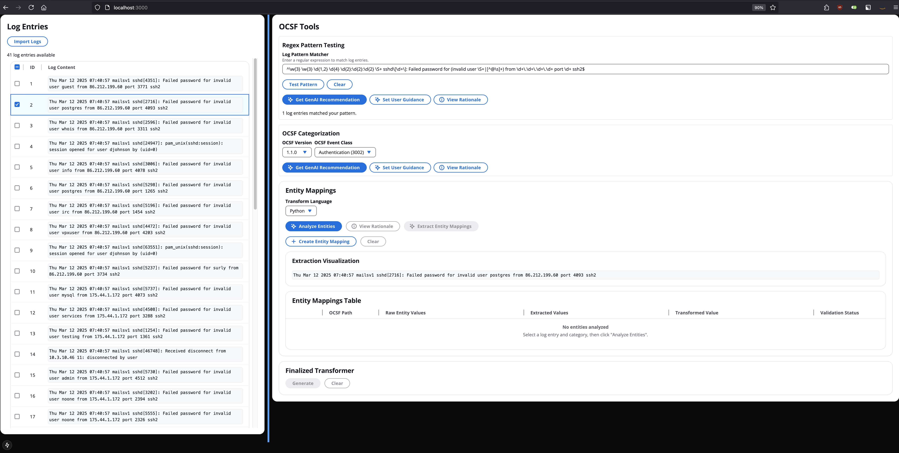
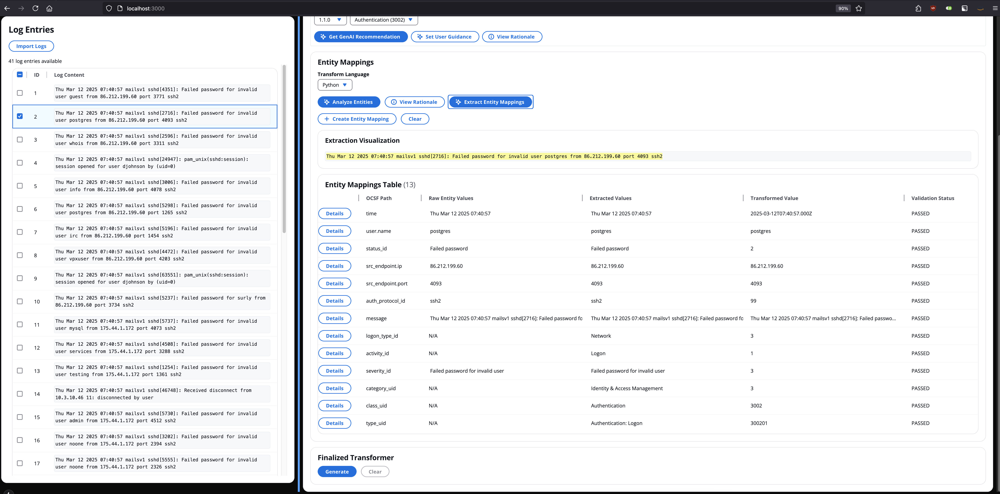
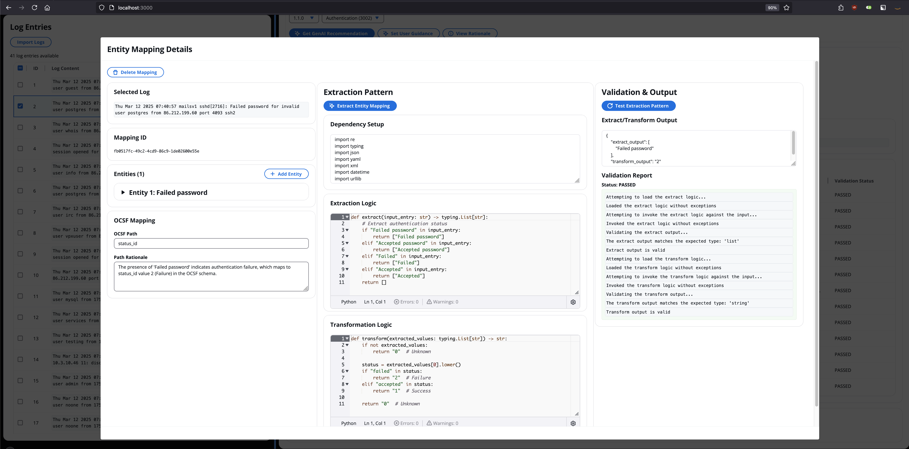
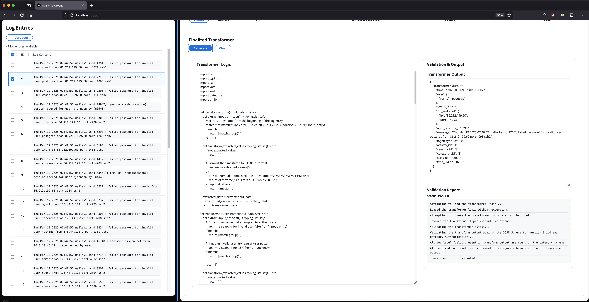

# OCSF Normalization Playground

This package contains the work-in-progress OCSF Normalization Playground app, a way for developers and security engineers to rapidly create and test transformations that convert log or data entries into an equivalent OCSF-compliant JSON blob with the help of GenAI assistance.

The Playground is a NextJS/React/Cloudscape frontend which provides a web interface and a Django REST API backend which performs the GenAI inference and valdiation.  The user interacts with the frontend, which reaches out to the backend as necessary.

### What problem is this trying to solve?

This app is focused on solving the general problem of taking a stream of data entries (such as system logs, AWS CloudTrail events, Microsoft 365 events, etc) and making it easy to create a Transformer that will map the entries of that stream to OCSF.

In this context, a Transformer is composed of (1) a targeting heuristic, such as a regex, that identifies specific entries in the data stream, (2) a OCSR category to normalize entries to, and (3) transformation logic which maps entries of that type into an OCSF-compliant JSON blob.  The app enables a GenAI-assisted workflow to enable users to create these Transformers in a web app run on their laptop/desktop.

If you have special knowledge of a particular stream, such as all of its events being of the same type, then you can skip the targeting heuristic and the OCSF categorization steps and proceed directly to making the transformation logic.

### The OCSF Normalization Playground workflow

After [launching the app](#launching-the-app), it will surface the web app at `http://127.0.0.1:3000` which you can hit in your web browser of choice.  The first step is to import some log entries, which you can do by pasting them into the modal window that pop up when you hit the `Import Logs` button in the top left corner.  It will split the log dump into entries by newline.  You can then either manually create the regex targeting heuristic and select the category, or get a GenAI recomendation (and review its rationale).



Next, you'll want to create the entity mappings.  Each entity mapping represents a mapping between one or more sections of the original data entry to a single, specific OCSF schema field in the output via some extraction and transformation logic.

Breaking that down more, we need to first identify which OCSF schema fields we must supply values for to be spec compliant and which other fields we can fulfill using the information in the data entry.  We must then figure out which sections of the data entry provide useful details to fulfill each OCSF schema field.  Next, we need to create some logic to extract those sections of the data entry for transformation, and another piece of logic to transform those sections into the final value we want to store in our OCSF output.  

You can either manually build these mappings using the UI (clicking `Create Entity Mapping` and then filling in the fields) or get a GenAI recommendation.  The `Analyze Entities` button gets a GenAI recommendation for the initial mapping between sections of the data entry and OCSF paths, while the `Extract Entity Mappings` button gets GenAI recommendations for the extraction/transformation logic.  You can see a visual representation of which portions of the original entry are being extracted/transformed in the `Extraction Visualization` section.



If you need to modify the GenAI recommendations (or your manual entity mappings), you can click the `Details` button on its row and edit any of the fields, test changes, etc.



Finally, you need to turn the individual entity mappings into a finalized Transformer by clicking the `Generate` button in the bottom right panel.  This takes all the line-item transformations, bundles them into a combined extract/transform function, and shows the final output.



This final Transformer logic can be stored for use outside the app.

### Known issues and caveats

* **Token Usage:** The `Analyze Entities` button which creates the initial mapping between the data entry and OCSF paths uses quite a few input tokens (tens of thousands) to accomplish its task because it's passing the full spec for the OCSF Event Class class and all OCSF Objects used in that event class to the LLM.  Additionally, it currently uses Claude 3.7 in "Thinking Mode", which uses even more tokens (though it does improve accuracy).  This can result in a variety of downstream issues, such as throttling and long response times.  The `Extract Entity Mappings` uses many fewer input tokens by only sending the portions of the OCSF specification to the LLM relevant to the specific OCSF paths identified in the analysis step, but may trigger throttling as well if it's run immediately after the `Analyze Entities` call.
* **Validation:** Further work is needed to validate the output of the transform functions for individual OCSF paths.  Currently, the validation performed is that the transform logic can be loaded/executed.  We need to go a step further and verify the value returned matches the OCSF specification as well.  This should be straightforward because that type information is available in the spec, but it has not been implemented yet.
* **OCSF Version Support:** The tool currently supports OCSF v1.1.0.  Adding support for additional versions should be straightforward using existing code pathways and conventions, but has not been implemented yet.
* **Transform Language Support:** The tool currently supports Python.  Adding support for additional languages should be straightforward using existing code pathways and conventions, but has not been implemented yet.

### Launching the app

#### Pre-requisites

You'll need the following apps installed:
* Python 3.10+ (this is what powers the Django REST API backend)
* NodeJS 20+/NPM 10+ (this is what powers the NextJS/React frontend)

Additionally, you'll need to provide access to AWS Bedrock, which is what the app uses for inference:
* Have AWS credentials capable of doing inference against Bedrock in `us-west-2` either in your `~/.aws/credentials` file or in environment variables.  See [the AWS docs](https://docs.aws.amazon.com/cli/latest/userguide/cli-chap-authentication.html) for more details.
* Have onboarded your AWS account to use Claude 3.7 Sonnet (`us.anthropic.claude-3-7-sonnet-20250219-v1:0`), also in `us-west-2`.  See here for [an explanation for how to do this](https://docs.aws.amazon.com/bedrock/latest/userguide/model-access.html).

#### Starting the app

You need to start both the backend and frontend before you can use the app.  To start up the backend:

```bash
# Start in the repo root

python3 -m venv venv
source venv/bin/activate
pipenv sync --dev

(cd playground && python3 manage.py runserver)
```

This will start a Django REST Framework API running at `http://127.0.0.1:8000`.

You should then start the frontend like so:

```bash
# Start in the repo root

(cd playground_frontend && npm install && npm run dev)
```

You should then be able to hit the Playground website in your web browser at `http://localhost:3000`.

#### How to handle changes to the backend API

The backend uses `drf-spectacular` to auto-supply an OpenAPI schema to the frontend so it can generate client code.  When you change the backend API, you'll need to regenerate the schema and client code, which you can do like so:

```bash
# Start in the repo root

(cd playground && python3 manage.py spectacular --file schema.json)

(cd playground_frontend && npm install && npm run generate-api-client)
```

### Where can I find logs?

The Playground's backend produces a fair amount of logs, which you can find in the logs directory:

```bash
# Start in the repo root

ls ./playground/logs
```

### Testing the backend

You can then hit the backend API directly with curl like so:

```bash
curl -X POST "http://127.0.0.1:8000/transformer/heuristic/create/" -H "Content-Type: application/json" -d '
{
    "input_entry": "Thu Mar 12 2025 07:40:57 mailsv1 sshd[4351]: Failed password for invalid user guest from 86.212.199.60 port 3771 ssh2"
}'

curl -X POST "http://127.0.0.1:8000/transformer/categorize/v1_1_0/" -H "Content-Type: application/json" -d '
{
    "input_entry": "Thu Mar 12 2025 07:40:57 mailsv1 sshd[4351]: Failed password for invalid user guest from 86.212.199.60 port 3771 ssh2"
}'

curl -X POST "http://127.0.0.1:8000/transformer/entities/v1_1_0/analyze/" -H "Content-Type: application/json" -d '
{
    "ocsf_category": "Authentication (3002)",
    "input_entry": "Thu Mar 12 2025 07:40:57 mailsv1 sshd[4351]: Failed password for invalid user guest from 86.212.199.60 port 3771 ssh2"
}'
```

### Testing the frontend

Here's an example M365 Active Directory login event:
```
{"Id":"12345678-90ab-cdef-1234-567890abcdef","CreatedDateTime":"2025-04-11T12:34:56Z","UserPrincipalName":"jdoe@contoso.com","UserId":"abc12345-6789-0abc-def1-234567890abc","AppDisplayName":"Microsoft Teams","ClientAppUsed":"Browser","AuthenticationDetails":[{"AuthenticationStepDateTime":"2025-04-11T12:34:56Z","AuthenticationMethod":"Password","Succeeded":true}],"ConditionalAccessStatus":"notApplied","DeviceDetail":{"OperatingSystem":"Windows 10","Browser":"Chrome 123"},"Location":{"City":"San Francisco","State":"California","CountryOrRegion":"US"},"Status":{"ErrorCode":0,"FailureReason":null},"IpAddress":"203.0.113.45"}
```

Here's an example Okta login event:
```
{"eventType":"user.session.start","published":"2025-04-11T09:01:00Z","actor":{"id":"00u1abcd1234XYZ","type":"User","alternateId":"jane.doe@example.com","displayName":"Jane Doe"},"outcome":{"result":"SUCCESS"},"client":{"ipAddress":"198.51.100.10","userAgent":{"rawUserAgent":"Mozilla/5.0 (Windows NT 10.0; Win64; x64)","browser":"CHROME","os":"Windows"}},"debugContext":{"debugData":{"authenticationContext":"PASSWORD","deviceFingerprint":"abcdef123456","zone":"Default Zone"}},"displayMessage":"User login to Okta"}
```

Here's some example input logs from RHEL `/var/log/secure` you can use for testing:
```
Thu Mar 12 2025 07:40:57 mailsv1 sshd[4351]: Failed password for invalid user guest from 86.212.199.60 port 3771 ssh2
Thu Mar 12 2025 07:40:57 mailsv1 sshd[2716]: Failed password for invalid user postgres from 86.212.199.60 port 4093 ssh2
Thu Mar 12 2025 07:40:57 mailsv1 sshd[2596]: Failed password for invalid user whois from 86.212.199.60 port 3311 ssh2
Thu Mar 12 2025 07:40:57 mailsv1 sshd[24947]: pam_unix(sshd:session): session opened for user djohnson by (uid=0)
Thu Mar 12 2025 07:40:57 mailsv1 sshd[3006]: Failed password for invalid user info from 86.212.199.60 port 4078 ssh2
Thu Mar 12 2025 07:40:57 mailsv1 sshd[5298]: Failed password for invalid user postgres from 86.212.199.60 port 1265 ssh2
Thu Mar 12 2025 07:40:57 mailsv1 sshd[5196]: Failed password for invalid user irc from 86.212.199.60 port 1454 ssh2
Thu Mar 12 2025 07:40:57 mailsv1 sshd[4472]: Failed password for invalid user vpxuser from 86.212.199.60 port 4203 ssh2
Thu Mar 12 2025 07:40:57 mailsv1 sshd[63551]: pam_unix(sshd:session): session opened for user djohnson by (uid=0)
Thu Mar 12 2025 07:40:57 mailsv1 sshd[5237]: Failed password for surly from 86.212.199.60 port 3734 ssh2
Thu Mar 12 2025 07:40:57 mailsv1 sshd[5737]: Failed password for invalid user mysql from 175.44.1.172 port 4073 ssh2
Thu Mar 12 2025 07:40:57 mailsv1 sshd[4508]: Failed password for invalid user services from 175.44.1.172 port 3288 ssh2
Thu Mar 12 2025 07:40:57 mailsv1 sshd[1254]: Failed password for invalid user testing from 175.44.1.172 port 1361 ssh2
Thu Mar 12 2025 07:40:57 mailsv1 sshd[46748]: Received disconnect from 10.3.10.46 11: disconnected by user
Thu Mar 12 2025 07:40:57 mailsv1 sshd[5730]: Failed password for invalid user admin from 175.44.1.172 port 4512 ssh2
Thu Mar 12 2025 07:40:57 mailsv1 sshd[3202]: Failed password for invalid user noone from 175.44.1.172 port 2394 ssh2
Thu Mar 12 2025 07:40:57 mailsv1 sshd[5555]: Failed password for invalid user noone from 175.44.1.172 port 2326 ssh2
Thu Mar 12 2025 07:40:57 mailsv1 sshd[1258]: Failed password for invalid user web002 from 175.44.1.172 port 4851 ssh2
Thu Mar 12 2025 07:40:57 mailsv1 sshd[12190]: pam_unix(sshd:session): session opened for user djohnson by (uid=0)
Thu Mar 12 2025 07:40:57 mailsv1 sshd[5240]: Failed password for invalid user sys from 175.44.1.172 port 1317 ssh2
Thu Mar 12 2025 07:40:57 mailsv1 sshd[4814]: Failed password for backup from 175.44.1.172 port 2985 ssh2
Thu Mar 12 2025 07:40:57 mailsv1 sshd[5267]: Failed password for invalid user library from 175.44.1.172 port 4666 ssh2
Thu Mar 12 2025 07:40:57 mailsv1 sshd[5535]: Failed password for invalid user mailman from 175.44.1.172 port 3188 ssh2
Thu Mar 12 2025 07:40:57 mailsv1 sshd[2581]: Failed password for root from 233.77.49.94 port 3670 ssh2
Thu Mar 12 2025 07:40:57 mailsv1 sshd[3757]: Failed password for invalid user administrator from 233.77.49.94 port 4139 ssh2
Thu Mar 12 2025 07:40:57 mailsv1 sshd[5309]: Failed password for squid from 233.77.49.94 port 1971 ssh2
Thu Mar 12 2025 07:40:57 mailsv1 sshd[5906]: Failed password for daemon from 91.205.40.22 port 2835 ssh2
Thu Mar 12 2025 07:40:57 mailsv1 sshd[4372]: Failed password for invalid user mongodb from 91.205.40.22 port 3568 ssh2
Thu Mar 12 2025 07:40:57 mailsv1 sshd[4472]: Failed password for invalid user ben from 91.205.40.22 port 3525 ssh2
Thu Mar 12 2025 07:40:57 mailsv1 sshd[95201]: Accepted password for nsharpe from 10.2.10.163 port 1211 ssh2
Thu Mar 12 2025 07:40:57 mailsv1 sshd[4117]: Failed password for invalid user email from 91.205.40.22 port 2790 ssh2
Thu Mar 12 2025 07:40:57 mailsv1 sshd[5937]: Failed password for invalid user yp from 91.205.40.22 port 4178 ssh2
Thu Mar 12 2025 07:40:57 mailsv1 sshd[3914]: Failed password for games from 91.205.40.22 port 2712 ssh2
Thu Mar 12 2025 07:40:57 mailsv1 sshd[3531]: Failed password for invalid user dba from 91.205.40.22 port 4907 ssh2
Thu Mar 12 2025 07:40:57 mailsv1 sshd[1552]: Failed password for invalid user mailman from 125.7.55.180 port 1095 ssh2
Thu Mar 12 2025 07:40:57 mailsv1 sshd[3451]: Failed password for invalid user email from 125.7.55.180 port 2392 ssh2
Thu Mar 12 2025 07:40:57 mailsv1 sshd[3497]: Failed password for invalid user irc from 125.7.55.180 port 1256 ssh2
Thu Mar 12 2025 07:40:57 mailsv1 su: pam_unix(su:session): session closed for user root
```

Here's some example web server logs:

```
199.15.234.66 - - [12/Mar/2025:18:24:31] "GET /cart.do?action=view&itemId=EST-6&productId=SC-MG-G10&JSESSIONID=SD5SL9FF2ADFF4958 HTTP 1.1" 200 3033 "http://www.google.com" "Mozilla/5.0 (Windows; U; Windows NT 5.1; en-US; rv:1.9.2.28) Gecko/20120306 YFF3 Firefox/3.6.28 ( .NET CLR 3.5.30729; .NET4.0C)" 177
175.44.24.82 - - [12/Mar/2025:18:44:36] "GET /category.screen?categoryId=SHOOTER&JSESSIONID=SD7SL9FF5ADFF5066 HTTP 1.1" 200 2334 "http://www.google.com" "Mozilla/5.0 (compatible; MSIE 9.0; Windows NT 6.1; WOW64; Trident/5.0; BOIE9;ENUS)" 546
175.44.24.82 - - [12/Mar/2025:18:44:37] "GET /product.screen?productId=WC-SH-A02&JSESSIONID=SD7SL9FF5ADFF5066 HTTP 1.1" 200 1184 "http://www.buttercupgames.com/oldlink?itemId=EST-16" "Mozilla/5.0 (compatible; MSIE 9.0; Windows NT 6.1; WOW64; Trident/5.0; BOIE9;ENUS)" 527
175.44.24.82 - - [12/Mar/2025:18:44:38] "GET /oldlink?itemId=EST-11&JSESSIONID=SD7SL9FF5ADFF5066 HTTP 1.1" 200 1814 "http://www.buttercupgames.com/category.screen?categoryId=TEE" "Mozilla/5.0 (compatible; MSIE 9.0; Windows NT 6.1; WOW64; Trident/5.0; BOIE9;ENUS)" 508
175.44.24.82 - - [12/Mar/2025:18:44:39] "GET /oldlink?itemId=EST-6&JSESSIONID=SD7SL9FF5ADFF5066 HTTP 1.1" 200 1073 "http://www.buttercupgames.com/oldlink?itemId=EST-6" "Mozilla/5.0 (compatible; MSIE 9.0; Windows NT 6.1; WOW64; Trident/5.0; BOIE9;ENUS)" 588
175.44.24.82 - - [12/Mar/2025:18:44:40] "POST /product.screen?productId=WC-SH-A01&JSESSIONID=SD7SL9FF5ADFF5066 HTTP 1.1" 200 3067 "http://www.buttercupgames.com/product.screen?productId=WC-SH-A01" "Mozilla/5.0 (compatible; MSIE 9.0; Windows NT 6.1; WOW64; Trident/5.0; BOIE9;ENUS)" 307
175.44.24.82 - - [12/Mar/2025:18:44:41] "GET /product.screen?productId=FI-AG-G08&JSESSIONID=SD7SL9FF5ADFF5066 HTTP 1.1" 200 545 "http://www.buttercupgames.com/category.screen?categoryId=ARCADE" "Mozilla/5.0 (compatible; MSIE 9.0; Windows NT 6.1; WOW64; Trident/5.0; BOIE9;ENUS)" 400
175.44.24.82 - - [12/Mar/2025:18:44:41] "POST /product.screen?productId=DC-SG-G02&JSESSIONID=SD7SL9FF5ADFF5066 HTTP 1.1" 200 2239 "http://www.buttercupgames.com/category.screen?categoryId=STRATEGY" "Mozilla/5.0 (compatible; MSIE 9.0; Windows NT 6.1; WOW64; Trident/5.0; BOIE9;ENUS)" 232
175.44.24.82 - - [12/Mar/2025:18:44:42] "POST /cart.do?action=addtocart&itemId=EST-12&productId=DC-SG-G02&JSESSIONID=SD7SL9FF5ADFF5066 HTTP 1.1" 200 1324 "http://www.buttercupgames.com/product.screen?productId=DC-SG-G02" "Mozilla/5.0 (compatible; MSIE 9.0; Windows NT 6.1; WOW64; Trident/5.0; BOIE9;ENUS)" 777
175.44.24.82 - - [12/Mar/2025:18:44:44] "POST /cart.do?action=purchase&itemId=EST-12&JSESSIONID=SD7SL9FF5ADFF5066 HTTP 1.1" 200 2399 "http://www.buttercupgames.com/cart.do?action=addtocart&itemId=EST-12&categoryId=STRATEGY&productId=DC-SG-G02" "Mozilla/5.0 (compatible; MSIE 9.0; Windows NT 6.1; WOW64; Trident/5.0; BOIE9;ENUS)" 594
175.44.24.82 - - [12/Mar/2025:18:44:44] "POST /cart/success.do?JSESSIONID=SD7SL9FF5ADFF5066 HTTP 1.1" 200 2378 "http://www.buttercupgames.com/cart.do?action=purchase&itemId=EST-12" "Mozilla/5.0 (compatible; MSIE 9.0; Windows NT 6.1; WOW64; Trident/5.0; BOIE9;ENUS)" 923
175.44.24.82 - - [12/Mar/2025:18:44:42] "GET /product.screen?productId=MB-AG-T01&JSESSIONID=SD7SL9FF5ADFF5066 HTTP 1.1" 200 273 "http://www.buttercupgames.com/product.screen?productId=MB-AG-T01" "Mozilla/5.0 (compatible; MSIE 9.0; Windows NT 6.1; WOW64; Trident/5.0; BOIE9;ENUS)" 976
175.44.24.82 - - [12/Mar/2025:18:44:42] "GET /category.screen?categoryId=SHOOTER&JSESSIONID=SD7SL9FF5ADFF5066 HTTP 1.1" 200 2922 "http://www.buttercupgames.com/product.screen?productId=WC-SH-G04" "Mozilla/5.0 (compatible; MSIE 9.0; Windows NT 6.1; WOW64; Trident/5.0; BOIE9;ENUS)" 801
175.44.24.82 - - [12/Mar/2025:18:44:42] "POST /cart.do?action=view&itemId=EST-21&productId=WC-SH-G04&JSESSIONID=SD7SL9FF5ADFF5066 HTTP 1.1" 200 675 "http://www.buttercupgames.com/oldlink?itemId=EST-21" "Mozilla/5.0 (compatible; MSIE 9.0; Windows NT 6.1; WOW64; Trident/5.0; BOIE9;ENUS)" 142
87.240.128.18 - - [12/Mar/2025:18:51:17] "GET /cart.do?action=changequantity&itemId=EST-17&productId=FS-SG-G03&JSESSIONID=SD3SL7FF10ADFF5088 HTTP 1.1" 200 2013 "http://www.google.com" "Mozilla/5.0 (Windows; U; Windows NT 5.1; en-US; rv:1.9.2.28) Gecko/20120306 YFF3 Firefox/3.6.28 ( .NET CLR 3.5.30729; .NET4.0C)" 293
92.1.170.135 - - [12/Mar/2025:19:06:04] "GET /category.screen?categoryId=STRATEGY&JSESSIONID=SD7SL7FF4ADFF5142 HTTP 1.1" 200 2413 "http://www.buttercupgames.com" "Mozilla/5.0 (Windows; U; Windows NT 5.1; en-US; rv:1.9.2.28) Gecko/20120306 YFF3 Firefox/3.6.28 ( .NET CLR 3.5.30729; .NET4.0C)" 484
92.1.170.135 - - [12/Mar/2025:19:06:05] "GET /product.screen?productId=FS-SG-G03&JSESSIONID=SD7SL7FF4ADFF5142 HTTP 1.1" 200 988 "http://www.buttercupgames.com/category.screen?categoryId=STRATEGY" "Mozilla/5.0 (Windows; U; Windows NT 5.1; en-US; rv:1.9.2.28) Gecko/20120306 YFF3 Firefox/3.6.28 ( .NET CLR 3.5.30729; .NET4.0C)" 547
92.1.170.135 - - [12/Mar/2025:19:06:06] "POST /cart.do?action=addtocart&itemId=EST-6&productId=FS-SG-G03&JSESSIONID=SD7SL7FF4ADFF5142 HTTP 1.1" 200 764 "http://www.buttercupgames.com/product.screen?productId=FS-SG-G03" "Mozilla/5.0 (Windows; U; Windows NT 5.1; en-US; rv:1.9.2.28) Gecko/20120306 YFF3 Firefox/3.6.28 ( .NET CLR 3.5.30729; .NET4.0C)" 703
92.1.170.135 - - [12/Mar/2025:19:06:06] "POST /cart.do?action=purchase&itemId=EST-6&JSESSIONID=SD7SL7FF4ADFF5142 HTTP 1.1" 503 3203 "http://www.buttercupgames.com/cart.do?action=addtocart&itemId=EST-6&categoryId=STRATEGY&productId=FS-SG-G03" "Mozilla/5.0 (Windows; U; Windows NT 5.1; en-US; rv:1.9.2.28) Gecko/20120306 YFF3 Firefox/3.6.28 ( .NET CLR 3.5.30729; .NET4.0C)" 242
176.212.0.44 - - [12/Mar/2025:19:12:27] "GET /product.screen?productId=CU-PG-G06&JSESSIONID=SD9SL8FF10ADFF5186 HTTP 1.1" 200 1905 "http://www.buttercupgames.com" "Mozilla/5.0 (iPad; CPU OS 5_1_1 like Mac OS X) AppleWebKit/534.46 (KHTML, like Gecko) Version/5.1 Mobile/9B206 Safari/7534.48.3" 748
```

### Generating the OCSF schemas

The OCSF schemas used to power this app are created by the [ocsf-lib-py package](https://github.com/ocsf/ocsf-lib-py).  This package is installed when you set up your Python Virtual Environment for this app.  You can generate a schema for a specific version like so:

```python
python3 -m ocsf.schema 1.5.0 > schema.json
```

### Dependencies
`pipenv` is used to managed dependencies within the project.  The `Pipefile` and `Pipefile.lock` handle the local environment.  You can add dependencies like so:

```
pipenv install boto3
```

This updates the `Pipfile`/`Pipfile.lock` with the new dependency.  To create a local copy of the dependencies, such as for bundling a distribution, you can use pip like so:

```
pipenv requirements > requirements.txt
python3 -m pip install -r requirements.txt -t ./package --upgrade

zip -r9 playground.zip tools/ package/
```
